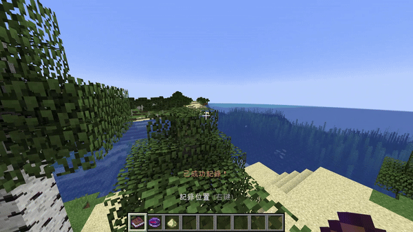

# 記錄位置資料包

## 展示

## 安裝方式
1. 下載資料包並解壓縮
2. 放到地圖檔的 `datapacks/` 資料夾內(可參考此[教學](https://zh.minecraft.wiki/w/Tutorial:安装数据包))
3. 在地圖內打上 `/reload` 指令
4. 使用指令 `/function record:install` 安裝
5. 使用指令 `/function record:setting` 設定

若要解除安裝，可使用指令 `/function record:uninstall`

## 使用方式
- 右鍵使用物品
- 書：記錄現在的位置
- 羅盤：傳送至書記錄的位置
- 海龜鱗甲：傳送至上一次傳送前的位置

## 連結
- [巴哈姆特](https://forum.gamer.com.tw/C.php?bsn=18673&snA=202145)
- [GitHub](https://github.com/AlexCai2019/Record-Position)
- [MediaFire](https://www.mediafire.com/file/986aliczvzdh1zt)